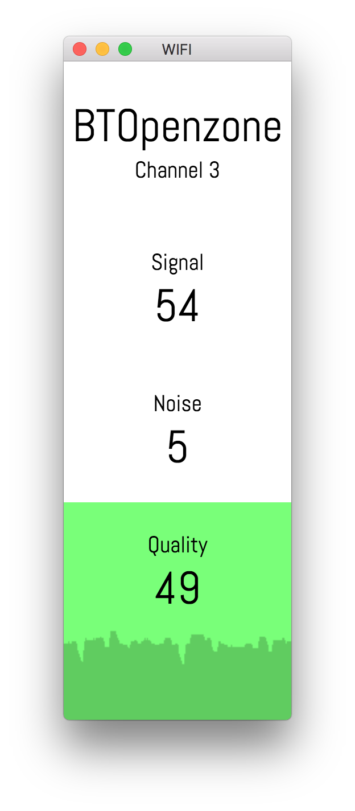

# wifi

A macOS desktop application that displays real-time WiFi network information and signal quality.

<div>
    
    
    
</div>

## Features

- Real-time WiFi signal strength (RSSI) monitoring
- Noise level display
- Signal quality calculation and visualization
- Live updating graph of signal quality over time
- Color-coded quality indicator (green = good, red = poor)

## Requirements

- macOS (uses Apple's private `airport` command for WiFi data)
- Node.js 18+

## Installation

```bash
npm install
```

## Usage

```bash
# Build the application
npm run compile

# Start the application
npm start
```

## Development

```bash
# Watch mode for development
npm run compile:watch

# Run tests
npm test

# Run tests with coverage
npm run test:coverage

# Lint code
npm run lint

# Format code
npm run format
```

## Tech Stack

- **Electron** - Desktop application framework
- **React 18** - UI framework with hooks
- **Webpack 5** - Module bundler
- **Sass** - CSS preprocessing
- **Jest** - Testing framework
- **ESLint & Prettier** - Code quality tools

## License

CC0-1.0
